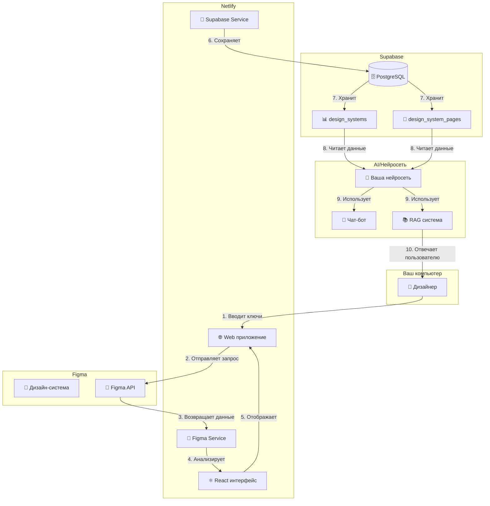
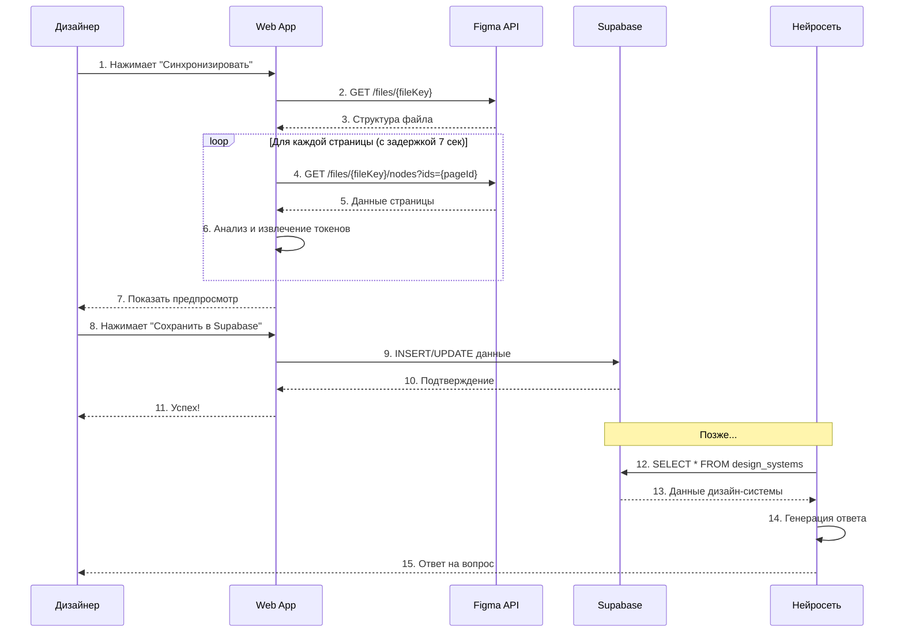
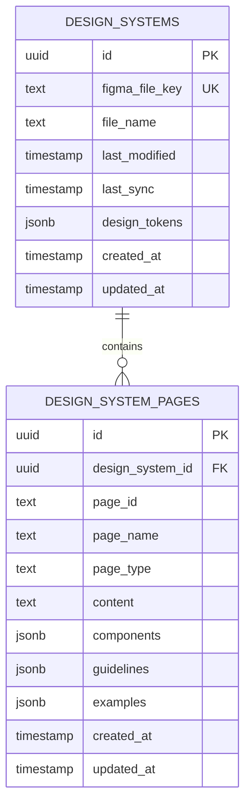
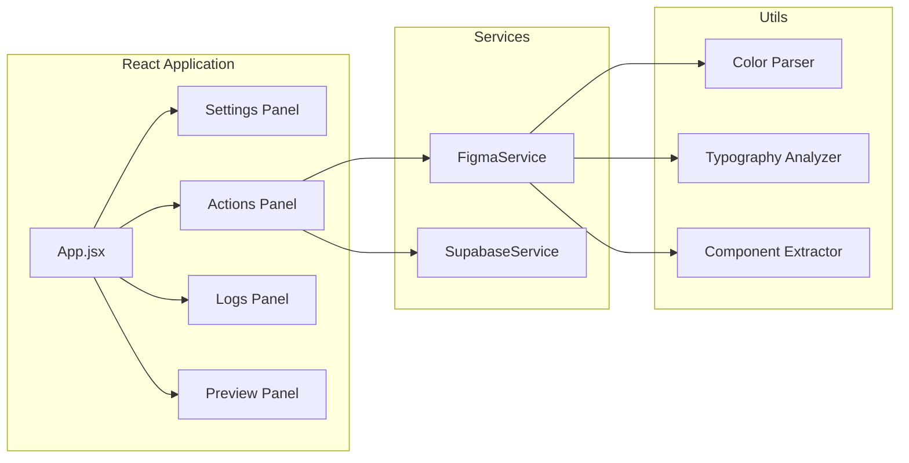
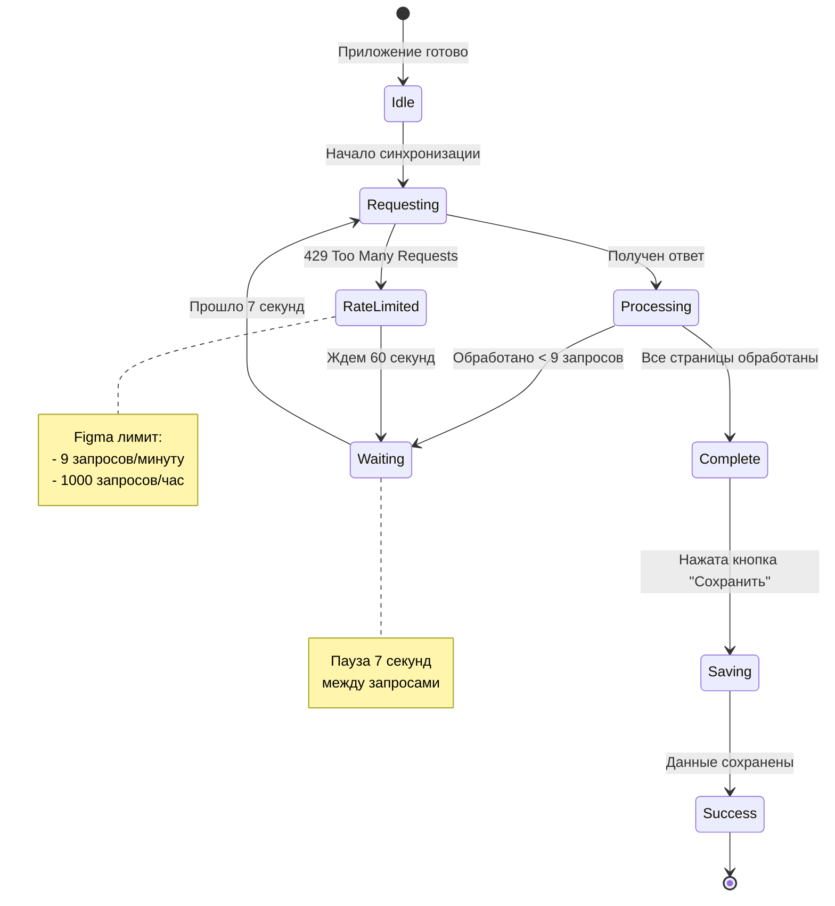
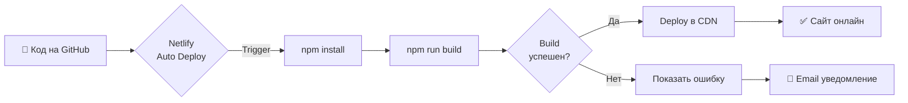

# 🏗️ Архитектура системы

## Общая схема



## Поток данных



## Структура данных



## Компоненты приложения



## Извлечение дизайн-токенов

```mermaid
flowchart TD
    Start[Начало обработки страницы] --> GetNode[Получить ноду]
    GetNode --> CheckType{Тип ноды?}
    
    CheckType -->|COMPONENT| ExtractComp[Извлечь компонент]
    CheckType -->|TEXT| ExtractTypo[Извлечь типографику]
    CheckType -->|FRAME/GROUP| CheckChildren{Есть дети?}
    
    ExtractComp --> SaveComp[Сохранить в components[]]
    ExtractTypo --> SaveTypo[Сохранить в typography]
    
    CheckChildren -->|Да| ProcessChildren[Обработать детей]
    CheckChildren -->|Нет| ExtractStyles[Извлечь стили]
    
    ProcessChildren --> GetNode
    
    ExtractStyles --> CheckFills{Есть fills?}
    CheckFills -->|Да| ExtractColors[Извлечь цвета]
    CheckFills -->|Нет| CheckStrokes{Есть strokes?}
    
    ExtractColors --> SaveColors[Добавить в colors Set]
    CheckStrokes -->|Да| ExtractBorders[Извлечь обводки]
    CheckStrokes -->|Нет| CheckEffects{Есть effects?}
    
    ExtractBorders --> SaveColors
    CheckEffects -->|Да| ExtractShadows[Извлечь тени]
    CheckEffects -->|Нет| CheckRadius{Есть radius?}
    
    ExtractShadows --> SaveShadows[Добавить в shadows[]]
    CheckRadius -->|Да| SaveRadius[Добавить в borderRadius Set]
    CheckRadius -->|Нет| CheckSpacing{Есть spacing?}
    
    SaveRadius --> CheckSpacing
    CheckSpacing -->|Да| SaveSpacing[Добавить в spacing Set]
    CheckSpacing -->|Нет| Done[Готово]
    
    SaveComp --> Done
    SaveTypo --> Done
    SaveColors --> Done
    SaveShadows --> Done
    SaveSpacing --> Done
```

## Обработка лимитов Figma



## Деплой процесс



---

Эти диаграммы помогут понять, как работает система и как данные перемещаются между компонентами!
